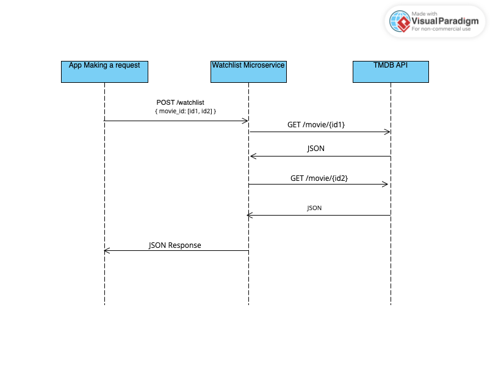

# MicroserviceA
Watchlist Microservice

This microservice allows users to request movie data using TMDB movieID's and receive metadata for the title and thumbnail poster URL

-------------------- COMMUNICATION CONTRACT (DO NOT CHANGE) --------------------

---------- How to REQUEST data ----------

Endpoint:

    http://localhost:3000/watchlist

Request Body (JSON):

    Send JSON object with a single key: 'movie_ids', which MUST be an array of TMBD movie ID's

Example of Request:

    '''json
    {
        "movie_id": [603, 574475] 
    }

---------- How to RECEIVE data ----------

Response Body (JSON):
    The microservice returns a JSON array. Each item in the array repressents a movie containing:
        - title : The title of the movie
        - poster_url : a thumbnail image URL for the movie poster

Example Reponse:
    
    {
      "title": "The Matrix",
      "poster_url": "https://image.tmdb.org/t/p/w200/f89U3ADr1oiB1s9GkdPOEpXUk5H.jpg"
    },
    {
      "title": "Final Destination: Bloodlines",
      "poster_url": "https://image.tmdb.org/t/p/w200/example123.jpg"
    }
    

